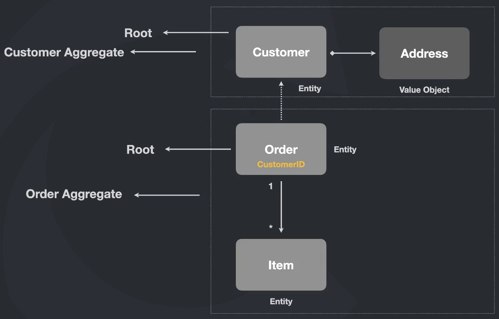
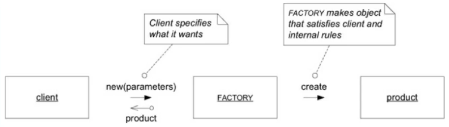

## Entidades

“Uma entidade é algo único que é capaz de ser alterado de forma contínua durante um longo período de tempo” - Vernon, Vaugh. Implementing Domain-Driven Design

“Uma entidade é algo que possui uma continuidade em seu ciclo de vida e pode ser distinguida independente dos atributos que são importantes para a aplicação do usuário. Pode ser uma pessoa, cidade, carro, um ticket de loteria ou uma transação bancária” - Evans, Eric. Domain-Driven Design

Basicamente, Entidade = IDENTIDADE

Entidade é algo que deve ser único e pode ser distinguido de outros elementos

### Entidade anêmica

```tsx
class Customer {
  _id: string;
  _name: string;
  _address: string;
  _active: boolean = true;

  constructor(id: string, name: string, address: string) {
    private this._id = id;
    private this._name = name;
    private this._address = address;
  }

  get id(): string {
    return this._id;
  }

  get name(): string {
    return this._name;
  }

  get address(): string {
    return this._address;
  }

  get active(): boolean {
    return this._active;
  }

  set name(name: string) {
    this._name = name;
  }

  set address(address: string) {
    this._address = address;
  }

  set active(active: boolean) {
    this._active = active;
  }
}
```

Por mais que seja uma classe representando uma entidade, com os devidos getters e setters, cada um dos métodos não traz clareza alguma de qual regra de negócio está representando. Todos os métodos não são expressivos o suficiente para quem ler entender o porque de cada coisa e quais as regras para definir cada coisa. Dessa maneira, baseado nesses pontos, essa entidade pode ser classificada como anêmica, uma entidade pobre com nada de clareza e alguns pontos que podem ferir regras de negócio.

### Entidade com modelagem rica

```tsx
class Customer {
  private this._id = id;
  private this._name = name;
  private this._address = address;
  private _active: boolean = true;

  constructor(id: string, name: string, address: string) {
    this._id = id;
    this._name = name;
    this._address = address;
  }
  
  get id(): string {
    return this._id;
  }

  get name(): string {
    return this._name;
  }

  get address(): string {
    return this._address;
  }
  
  isActive(): boolean {
    return this._active;
  }

  changeName(name: string) {
    this._name = name;
  }

  activate() {
    if (!this._address) {
      throw new Error('Cannot activate customer without an address');
    }

    this._active = true;
  }

  deactivate() {
    this._active = false;
  }
}
```

Aqui temos um bom exemplo de uma classe representando uma entidade com uma modelagem mais elaborada. Primeiramente, temos métodos mais expressivos e que deixam claro suas intenções e regras de negócio. Por exemplo o método `changeName` , ainda que na prática seja semelhante a um simples setter, pelo seu nome já tenho claro o que ele significa dentro dessa entidade, a qual regra ele se aplica e porque de sua existência. Além disso, se pegarmos agora o método `activate` , nota-se que existe uma regra de negócio dentro do método, apenas customers com endereço definido podem ser ativados. Isso é uma validação, diz respeito a uma regra de negócio, está bem clara no método e traz toda uma expressividade de responsabilidade desse método dentro da entidade.

### Princípio da auto validação

```tsx
class Customer {
  private _id: string;
  private _name: string;
  private _address: string;
  private _active: boolean = true;

  constructor(id: string, name: string, address: string) {
    this._id = id;
    this._name = name;

    this.validateId();
    this.validateName();
    this.validateAddress();
  }

  get id(): string {
    return this._id;
  }

  get name(): string {
    return this._name;
  }

  get address(): string {
    return this._address;
  }
  
  isActive(): boolean {
    return this._active;
  }

  changeName(name: string) {
    this._name = name;
    this.validateName();
  }

  activate() {
    if (!this._address) {
      throw new Error('Cannot activate customer without an address');
    }

    this._active = true;
  }

  deactivate() {
    this._active = false;
  }

  private validateId() {
    if (!this._id) {
      throw new Error('id is required');
    }
  }

  private validateName() {
    if (!this._name) {
      throw new Error('name is required');
    }
  }

  private validateAddress() {
    if (!this._address) {
      throw new Error('address is required');
    }
  }
}
```

Toda entidade deve obrigatoriamente possuir suas validações próprias e internas à entidade. Nunca, em hipótese alguma, as validações devem ser feitas por quem for usar a entidade. Todas as regras de negócio e validações devem estar contidas exclusivamente, e apenas, dentro de entidade. Isso porque, a entidade por si só tem que garantir o seu próprio estado, de modo que quem usá-la não tem a obrigação de saber quais são as regras e validações necessárias para usar a entidade. Além disso, ter tudo concentrado dentro da classe traz mais segurança para a camada de negócio da aplicação.

## Value Objects

“Quando você se preocupa apenas com os atributos de um elemento de um model, classifique isso como um Value Object”

“Trate o Value Object como imutável”

Evans, Eric. Domain-Driven Design

Tomemos como exemplo um endereço representado por um value object, que normalmente tem as propriedades rua, número, cidade, estado e cep.

Essas propriedades em conjunto representam exclusivamente um endereço, de modo que se uma dessas propriedades ser alterada, o endereço torna-se um outro totalmente diferente do anterior. Por isso um value object é imutável, pois o value object não é alterado quando uma das propriedade é alterada, na verdade cria-se um novo value object.

Um value object não precisa ter um identidade único, pois ele não é único, é apenas um conjunto de propriedades.

Um value object tem que se auto validar sempre.

### Exemplo

```tsx
export class Address {
  private _street: string = '';
  private _number: number = 0;
  private _zip: string = '';
  private _city: string = '';

  constructor(street: string, number: number, zip: string, city: string) {
    this._street = street;
    this._number = number;
    this._zip = zip;
    this._city = city;
    
    this.validate();
  }

  get street(): string {
    return this._street;
  }

  get number(): number {
    return this._number;
  }

  get zip(): string {
    return this._zip;
  }

  get city(): string {
    return this._city;
  }

  validate() {
    if (this._street.length === 0) {
      throw new Error('street is required');
    }
    if (this._number === 0) {
      throw new Error('number is required');
    }
    if (this._zip.length === 0) {
      throw new Error('zip is required');
    }
    if (this._city.length === 0) {
      throw new Error('city is required');
    }
  }

  toString() {
    return `${this._street}, ${this._number}, ${this._zip} ${this._city}`;
  }
}
```

### Exemplo de uso do Value Object

```tsx
class Customer {
  private _id: string;
  private _name: string;
  private _address: Address;
  private _active: boolean = true;

  constructor(id: string, name: string) {
    this._id = id;
    this._name = name;
    
    this.validateId();
    this.validateName();
  }

  get id(): string {
    return this._id;
  }

  get name(): string {
    return this._name;
  }

  get address(): Address {
    return this._address;
  }

  isActive(): boolean {
    return this._active;
  }

  changeName(name: string) {
    this._name = name;
    this.validateName();
  }

  activate() {
    if (!this._address) {
      throw new Error('Cannot activate customer without an address');
    }

    this._active = true;
  }

  deactivate() {
    this._active = false;
  }
  
  changeAddress(address: Address) {
    this._address = address;
  }

  private validateId() {
    if (!this._id) {
      throw new Error('id is required');
    }
  }

  private validateName() {
    if (!this._name) {
      throw new Error('name is required');
    }
  }
}
```

## Aggregates

“Um aggregate é um conjunto de objetos associados que tratamos como uma unidade para propósito de mudança de dados” - Evans, Eric. Domain-Driven Design

<h1 align="center">
  
</h1>

- O elemento entidade que atua como entrypoint para o aggregate é o Root Aggregate
- O nome de um aggregate, de forma lógica, é o nome do elemento Root + Aggregate
    - Customer Aggregate
    - Order Aggregate
- Se dentro de um aggregate existir uma relação com um elemento de outro aggregate, isso se dá pelo ID. Se essa relação for com um elemento do mesmo aggregate, usa-se o elemento por completo.
- Customer Aggregate
    - Customer não precisa necessariamente de uma Order para ser criado
    - Address é um Value Object e não uma entidade porque não tem identificador único e é uma estrutura que existe apenas como um wrap para as propriedades que compõem um endereço. Logo não há necessidade de ser uma entidade
- Order Aggregate
    - Order se relaciona com um Customer pelo identificador único do Customer (ID)
    - Para que uma Order exista, deve existir necessariamente ao menos um Item
    - Item não pode existir fora de uma Order
    - Uma Order pode ter N entidades Item relacionadas com ela

### Exemplo

```tsx
export class OrderItem {
  private _id: string;
  private _name: string;
  private _price: number;

  constructor(id: string, name: string, price: number) {
    this._id = id;
    this._name = name;
    this._price = price;
  }

```

```tsx
export class Order {
  private _id: string;
  private _customerId: string;
  private _items: OrderItem[];

  constructor(id: string, customerId: string, items: OrderItem[]) {
    this._id = id;
    this._customerId = customerId;
    this._items = items;
  }
}
```

### Exemplo de uso dos Aggregates

```tsx
// Customer Aggregate
const customer = new Customer('123', 'John Doe');
const address = new Address('Main St', 123, '12345', 'Anytown');
customer.changeAddress(address);
customer.activate();

// Order Aggregate
const item1 = new OrderItem('1', 'Item 1', 100);
const item2 = new OrderItem('2', 'Item 2', 200);
const order = new Order('1', customer.id, [item1, item2]);
```

## Domain Services

“Um serviço de domínio é uma operação sem estado que cumpre uma tarefa específica do domínio. Muitas vezes, a melhor indicação de que você deve criar um serviço no modelo de domínio é quando a operação que você precisa executar parece não se encaixar como um método em um Aggregate ou em um Value Object” - Vernon, Vaugh. Implementing Domain-Driven Design

“Quando um processo ou transformação significativa no domínio não for responsabilidade natural de uma entidade ou objeto de valor, adicione uma operação ao modelo como uma interface autônoma declarada como um serviço. Defina a interface baseada na linguagem do modelo de domínio e certifique-se de que o nome da operação faça parte da linguagem ubíqua. Torne o serviço sem estado” - Evans, Eric. Domain-Driven Design

Um outro indicativo que mostra a necessidade de um domain service é quando precisa-se executar uma operação que faz uso de entidades de outro aggregate.

Algumas situações onde faz sentido implementar um domain service:

- Realizar uma operação em lote
    - Ex: mudar o preço de todos os produtos de um sistema
- Calcular/Processar algo cujas informações constam em mais de uma entidade

### Cuidados

- Quando houver muitos Domain Services em seu projeto, TALVEZ, isso pode indicar que seus aggregates estão anêmicos
- Domain Services são stateless

### Exemplo

```tsx
class OrderService {
  static placeOrder(customer: Customer, items: OrderItem[]): Order {
    if (items.length === 0) {
      throw new Error('Order must have at least one item');
    }

    const order = new Order(randomUUID(), customer.id, items);

    customer.addRewardsPoints(order.total() / 2);

    return order;
  }

  static total(orders: Order[]): number {
    return orders.reduce((acc, order) => acc + order.total(), 0);
  }
}
```

```tsx
export class ProductService {
  static increasePrice(products: Product[], percentage: number): Product[] {
    products.forEach((product) => {
      const price = product.price * (percentage / 100) + product.price;
      product.changePrice(price);
    });

    return products;
  }
}
```

## Repositories

Um repositório comumente se refere a um local de armazenamento, geralmente considerado um local de segurança ou preservação dos itens nele armazenados. Quando você armazena algo em um repositório e depois retorna para recuperá-lo, você espera que ele esteja no mesmo estado que estava quando você colocou lá. Em algum momento, você pode optar por remover o item armazenado do repositório.

Vernon, Vaugh. Implementing Domain-Driven Design

Esses objetos semelhantes a coleções são sobre persistência. Todo tipo Agregado persistente terá um Repositório. De um modo geral, existe uma relação um-para-um entre um tipo Agregado e um Repositório.

Vernon, Vaugh. Implementing Domain-Driven Design

### Exemplo

```tsx
interface Repository<T> {
  create(entity: T): Promise<void>;
  update(entity: T): Promise<void>;
  find(id: string): Promise<T>;
  findAll(): Promise<T[]>;
}
```

```tsx
export interface CustomerRepository extends Repository<Customer> {}
```

```tsx
class SequelizeCustomerRepository implements CustomerRepository {
  async create(entity: Customer): Promise<void> {
    await CustomerModel.create({
      id: entity.id,
      name: entity.name,
      street: entity.address.street,
      number: entity.address.number,
      zipcode: entity.address.zip,
      city: entity.address.city,
      active: entity.isActive(),
      rewardPoints: entity.rewardsPoints,
    });
  }

  async update(entity: Customer): Promise<void> {
    await CustomerModel.update(
      {
        name: entity.name,
        street: entity.address.street,
        number: entity.address.number,
        zipcode: entity.address.zip,
        city: entity.address.city,
        active: entity.isActive(),
        rewardPoints: entity.rewardsPoints,
      },
      {
        where: {
          id: entity.id,
        },
      },
    );
  }

  async find(id: string): Promise<Customer> {
    let customerModel;
    try {
      customerModel = await CustomerModel.findOne({
        where: {
          id,
        },
        rejectOnEmpty: true,
      });
    } catch (error) {
      throw new Error('Customer not found');
    }

    const customer = new Customer(id, customerModel.name);
    const address = new Address(
      customerModel.street,
      customerModel.number,
      customerModel.zipcode,
      customerModel.city,
    );
    customer.changeAddress(address);
    return customer;
  }

  async findAll(): Promise<Customer[]> {
    const customerModels = await CustomerModel.findAll();

    const customers = customerModels.map((customerModels) => {
      const customer = new Customer(customerModels.id, customerModels.name);
      customer.addRewardsPoints(customerModels.rewardPoints);
      const address = new Address(
        customerModels.street,
        customerModels.number,
        customerModels.zipcode,
        customerModels.city,
      );
      customer.changeAddress(address);
      if (customerModels.active) {
        customer.activate();
      }
      return customer;
    });

    return customers;
  }
}

```

## Domain Events

“Use um evento de domínio para capturar uma ocorrência de algo que aconteceu no domínio” - Vernon, Vaugh. Implementing Domain-Driven Design

“A essência de um evento de domínio é que você o usa para capturar coisas que podem desencadear uma mudança no estado do aplicativo que você está desenvolvendo. Esses objetos de eventos são processados para causar alterações no sistema e armazenados para fornecer um AuditLog” - Fowler, Martin. Domain Event

Todo evento deve ser representado em uma ação realizada no passado:

- UserCreated
- OrderPlaced
- EmailSent

### Quando utilizar

Normalmente um Domain Event deve ser utilizado quando queremos notificar outros Bounded Contexts de uma mudança de estado.

### Componentes

- Event
    - Normalmente tem os dados que fizeram parte da ocorrência do evento, além da data de quando ocorreu o evento
- Handler
    - Executa o processamento quando um evento é chamado
- Event Dispatcher
    - Responsável por armazenar e executar os handlers de um evento quando ele for disparado

### Dinâmica

→ Criar um “Event Dispatcher”

→ Criar um “Event”

→ Criar um “Handler” para o “Event”

→ Registrar o “Event”, juntamente com o “Handler” no “Event Dispatcher”

Agora para disparar um evento, basta executar o método “notify” do “Event Dispatcher”. Nesse momento, todos os handlers registrados no evento serão executados

### Exemplo

```tsx
export interface DomainEvent<T = any> {
  occurredAt: Date;
  eventData: T;
}
```

```tsx
export interface EventHandler<T extends DomainEvent = DomainEvent> {
  handle(event: T): void;
}
```

```tsx
export interface EventDispatcher {
  register(eventName: string, eventHandler: EventHandler): void;
  unregister(eventName: string, eventHandler: EventHandler): void;
  unregisterAll(): void;
  notify(event: DomainEvent): void;
}
```

```tsx
interface StubyCreatedProductEventProps {
  name: string;
  price: number;
  email: string;
}

class StubyCreatedProductEvent implements DomainEvent<StubyCreatedProductEventProps> {
  occurredAt: Date;
  eventData: StubyCreatedProductEventProps;

  constructor(eventData: StubyCreatedProductEventProps) {
    this.occurredAt = new Date();
    this.eventData = eventData;
  }
}

class StubySendEmailWhenProductIsCreatedHandler
  implements EventHandler<StubyCreatedProductEvent>
{
  handle(event: StubyCreatedProductEvent): void {
    console.log(`Sending email to ${event.eventData.email}`);
  }
}

class StubyEventDispatcher implements EventDispatcher {
  private handlers: Map<string, EventHandler[]> = new Map();

  get getEventHandlers(): { [eventName: string]: EventHandler[] } {
    const data: { [eventName: string]: EventHandler[] } = {};

    this.handlers.forEach((value, key) => {
      data[key] = value;
    });

    return data;
  }

  register(eventName: string, eventHandler: EventHandler): void {
    if (!this.handlers.has(eventName)) {
      this.handlers.set(eventName, []);
    }

    this.handlers.get(eventName)!.push(eventHandler);
  }

  unregister(eventName: string, eventHandler: EventHandler): void {
    if (!this.handlers.has(eventName)) {
      return;
    }

    const handlers = this.handlers.get(eventName)!;
    const index = handlers.indexOf(eventHandler);

    if (index !== -1) {
      handlers.splice(index, 1);
    }
  }

  unregisterAll(): void {
    this.handlers.clear();
  }

  notify(event: DomainEvent): void {
    const eventName = event.constructor.name;

    if (!this.handlers.has(eventName)) {
      return;
    }

    const handlers = this.handlers.get(eventName)!;

    handlers.forEach((handler) => {
      handler.handle(event);
    });
  }
}
```

## Modules

Em um contexto de DDD, Módulos em seu modelo servem como containers nomeados para classes de objetos de domínio que são altamente coesas entre si. O objetivo deve ser baixo acoplamento entre as classes que estão em módulos diferentes. Como os Módulos usados no DDD não são compartimentos de armazenamento anêmicos ou genéricos, também é importante nomear adequadamente os Módulos - Vernon, Vaugh. Implementing Domain-Driven Design

### Pontos importantes

- Respeitar a linguagem universal
    - O nome dos módulos deve deixar totalmente claro sobre o que é aquele, a qual bounded context diz respeito
- Baixo acoplamento
    - Módulos independentes um do outro
- Um ou mais agregados devem estar juntos somente se fazer sentido
- Organizado pelo domínio/subdomínio e não pelo tipo de objetos
- Devem respeitar a mesma divisão quando estão em camadas diferentes

## Factories

Desloque a responsabilidade de criar instâncias de objetos complexos e agregados para um objeto separado, que pode não ter responsabilidade no modelo de domínio, mas ainda faz parte do design do domínio. Forneça uma interface que encapsula toda a criação complexa e que não exija que o cliente faça referência às classes concretas dos objetos que estão sendo instanciados. Crie agregados inteiros de uma única vez, reforçando suas variantes.

<h1 align="center">
  
</h1>

Evans, Eric. Domain-Driven Design

### Exemplo

```tsx
export class CustomerFactory {
  static create(name: string): Customer {
    const id = randomUUID();

    return new Customer(id, name);
  }

  static createWithAddress(name: string, address: Address): Customer {
    const id = randomUUID();

    const customer = new Customer(id, name);
    customer.changeAddress(address);

    return customer;
  }
}
```
